说明:
http://192.168.200.131:8848/
为自己的windows电脑NAT模式vmware安装centOS固定ip的虚拟机
nacos版本为2, 采用了服务发现, 负载均衡和配置中心
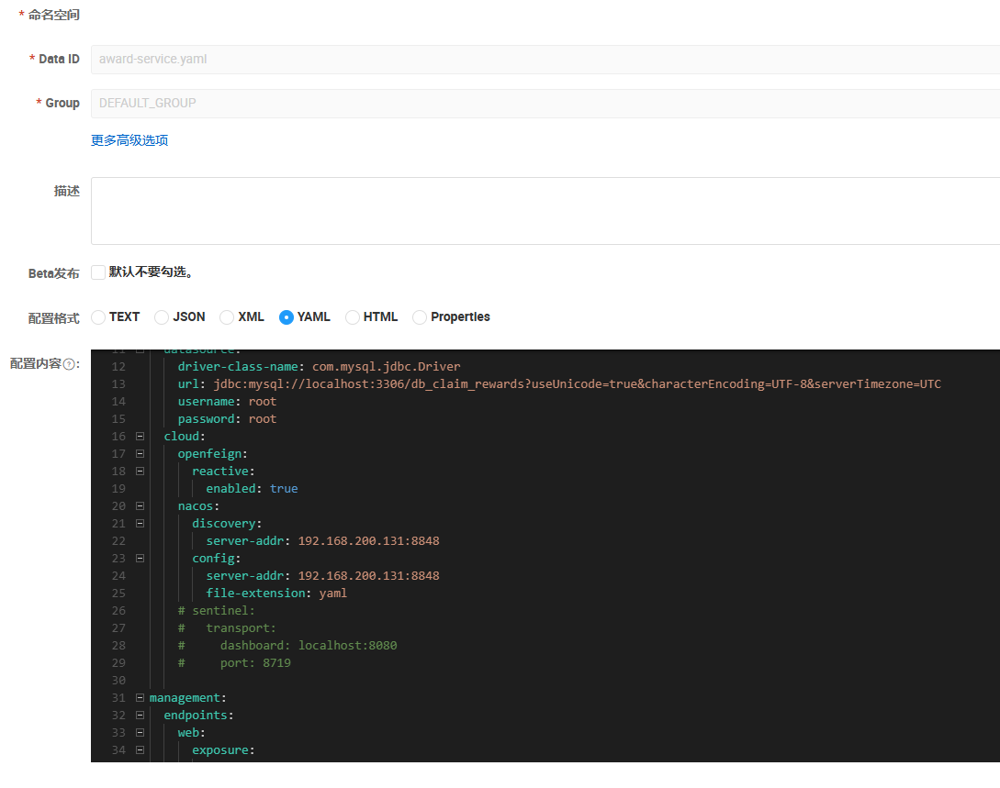

1.登录
post
http://localhost:51601/api/user/v1/login/login_auth
{
"password": "123456",
"phone": "17702142270"
}
获取token

2.领取奖励
post
http://localhost:51601/api/rewards/claim
head需要携带第一个步骤返回的token

通过sentinel做了qps为2000的限流
通过jmeter测试并发
sentinel也是部在了vmware虚拟机上
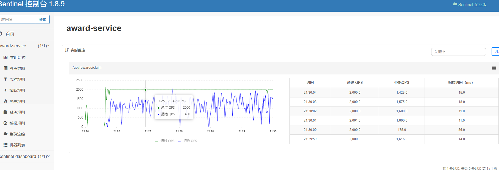

qps100
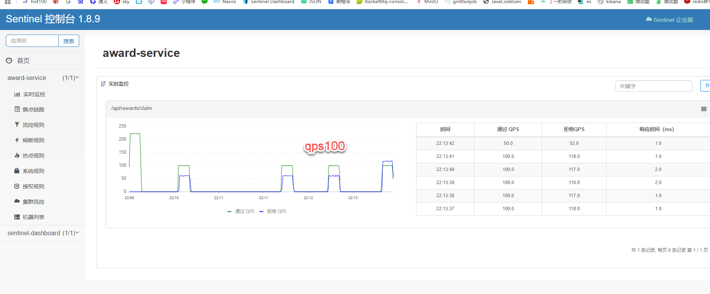

但jmeter导出的表格,每秒请求最多成功50个,是sentinel设置的qps的100个的一半:
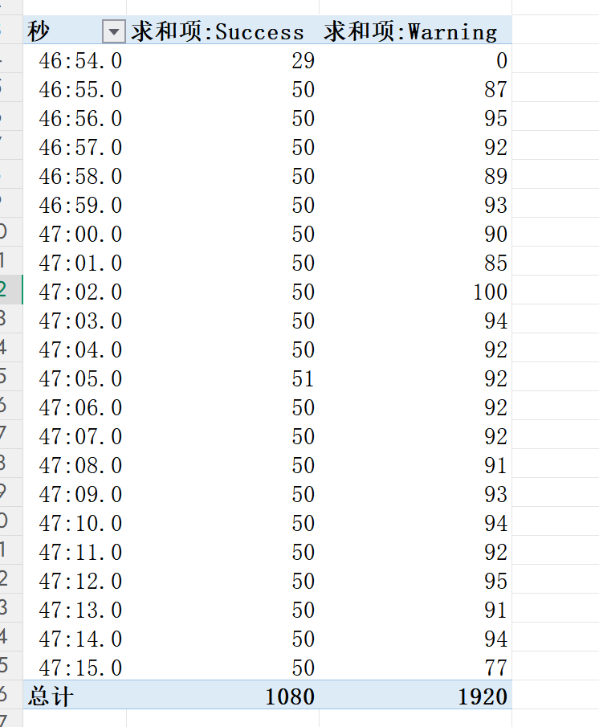

熔断降级测试(熔断规则,按照 异常数 熔断, 熔断1秒, 最小请求数 6个, 统计时长1000ms)

如果拦截到了DegradeException.class
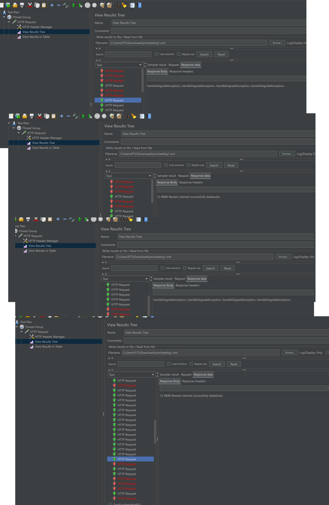

如果配置了fallback,则会触发fallback 
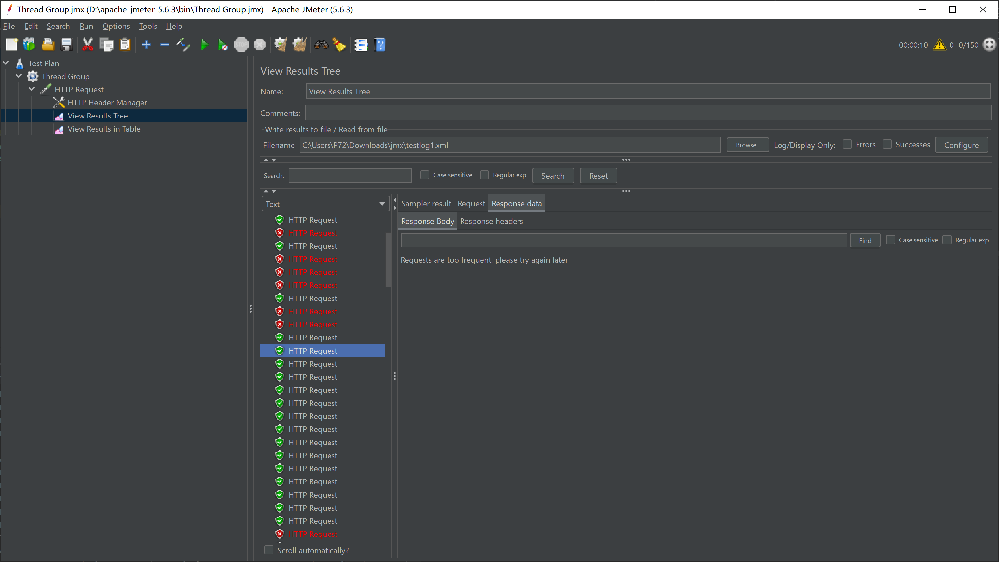

fallback压测参数如下, 有20%的几率有算数错误, 每秒10个请求,异常数阈值为3次,则平均错误的请求是10*0.2=2次,有可能到达3次,熔断1秒后恢复
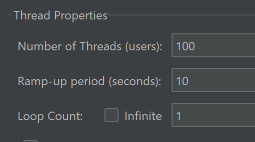

3.领取奖励按照用户id进行限流
xx秒内只能领取xx次奖励
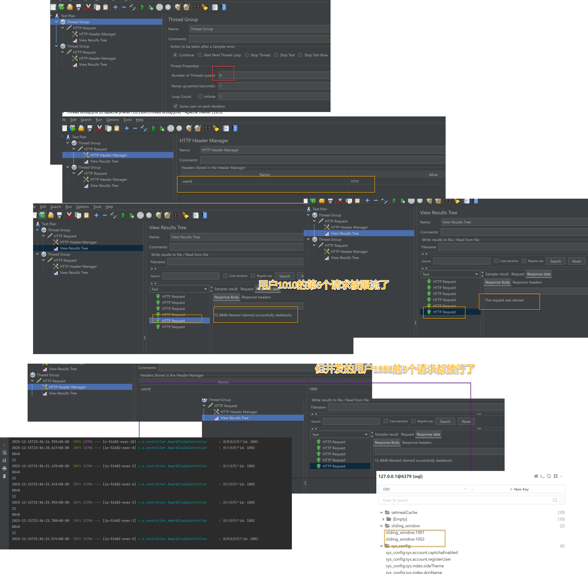

-----------------------------------------------------------------------------------------------------------------------------------------------------------------------------------------------------------------------------------------------------------------------------------------------------------------------------------------------------------------------------------------------------------------------------------------------------------------------------------------------------------------------------------------------------------------------------------------------------------------------------------------------------------------------------------------------------------------------------------------------------------------------------------------------------------------------------------------------------------------------------------------------------------------------------------------------------------------------------------------------------------------------------------------------------------------------------------------------------------------------------------------------------------------------------------------------------------------------------------------------------------------------------------------------------------------------------------------------------------------------------------------------------------------------------------------------------------------------------------------------------------------------------------------------------------------------------------------------------------------------------------------------------------------------------------------------------------------------------------------------------------------------------------------------------------------------------------------------------------------------------------------------------------------------------------------------------------------------------------------------------------------------------------------------------------------------------------------------------------------------------------------------------------------------------------------------------------------------------------------------------------------------------------------------------------------
后续类似项目,可以考虑把描述给通义灵码

192.168.200.131
192.168.200.2

vmware的centos
nat模式
固定ip
IPADDR="192.168.22.110"
GATEWAY="192.168.22.2"
DNS1="192.168.22.2"

现在有一个空工程, 叫reward-claim.

这个项目需要用jdk17, 而不是jdk8.
也就是说, 后续所有的相关依赖,需要保证在jkd17下面可用.
这个项目需要使用springboot.
这个项目需要使用到nacos的服务发现和配置中心(nacos不需要集群,不需要namespace).
需要使用到sentinel模块(对接口/api/rewards/claim进行全局限流).
需要使用到openfeign模块.
需要引用spring-cloud-starter-gateway依赖.
所有的依赖, 都创建在父工程的pom文件下面, 做为parent依赖, 子模块只选用父项目的依赖,不直接引入依赖.
后续发现什么依赖, 都放到父工程的pom依赖下面统一管理版本.

需要在空工程下, 搭建以下模块,
1.gateway-service
网关模块, 需要引入spring-cloud-starter-gateway网关, 对jwt的token鉴权.
需要实现以/api/rewards开头的接口, 都放行给award-service服务
2.award-service
包含一个/api/rewards/claim接口
-需要通过openfeign调用user-service获取用户等级, 调用order-service
获取用户订单数量,来决定领取多少奖励
-需要获取一些nacos配置中心的配置
配置需要动态刷新(无需重启服务)
3.user-service
需要多实例保证高可用
4.order-service

jmeter测试配置的sentinel的qps流控规则和熔断降级规则是否生效
  
elastic-job分片作业,分片的世界
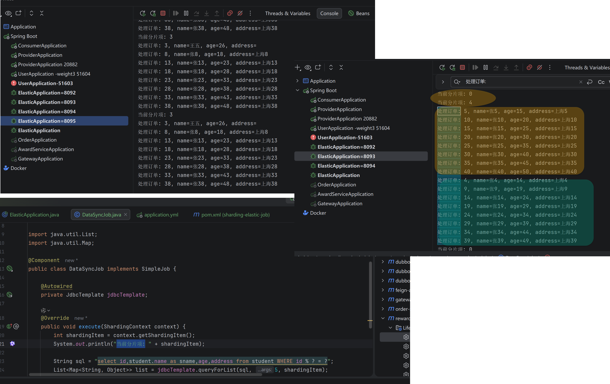

动态修改dubbo服务权重
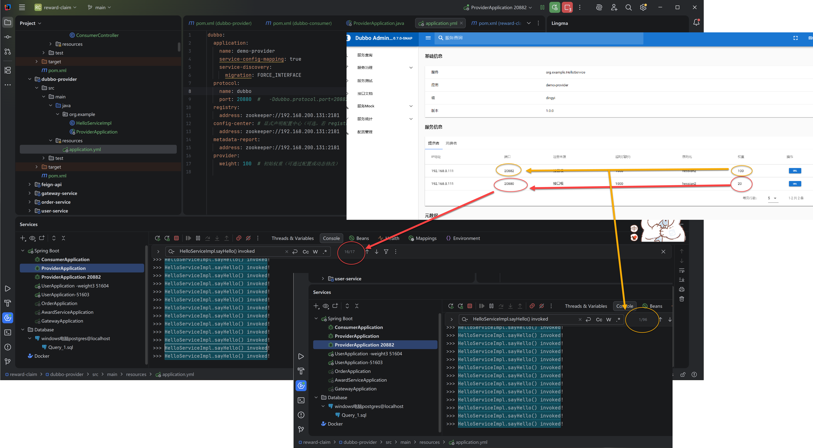

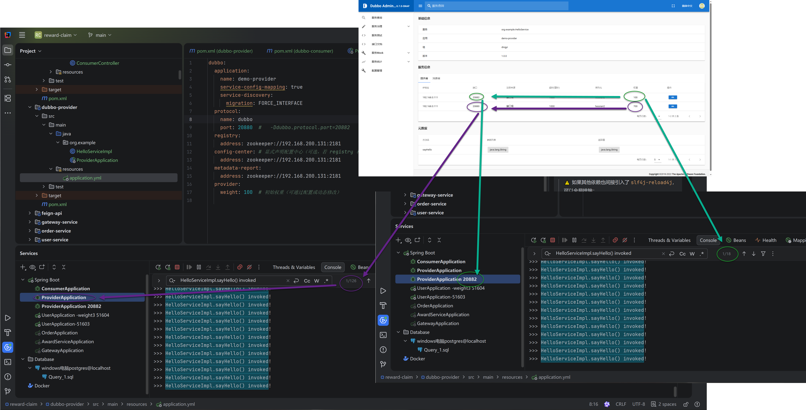

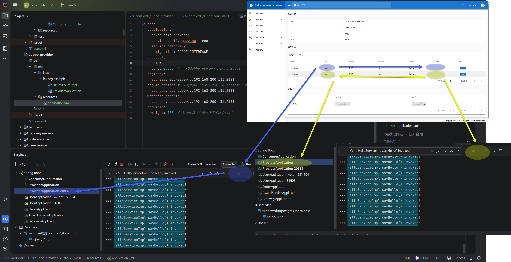

skywalking追踪异步线程\restTemplate的http调用和dubbo调用

seata不能回滚存储过程

canal-server的rabbitMq模式,伪装成从节点
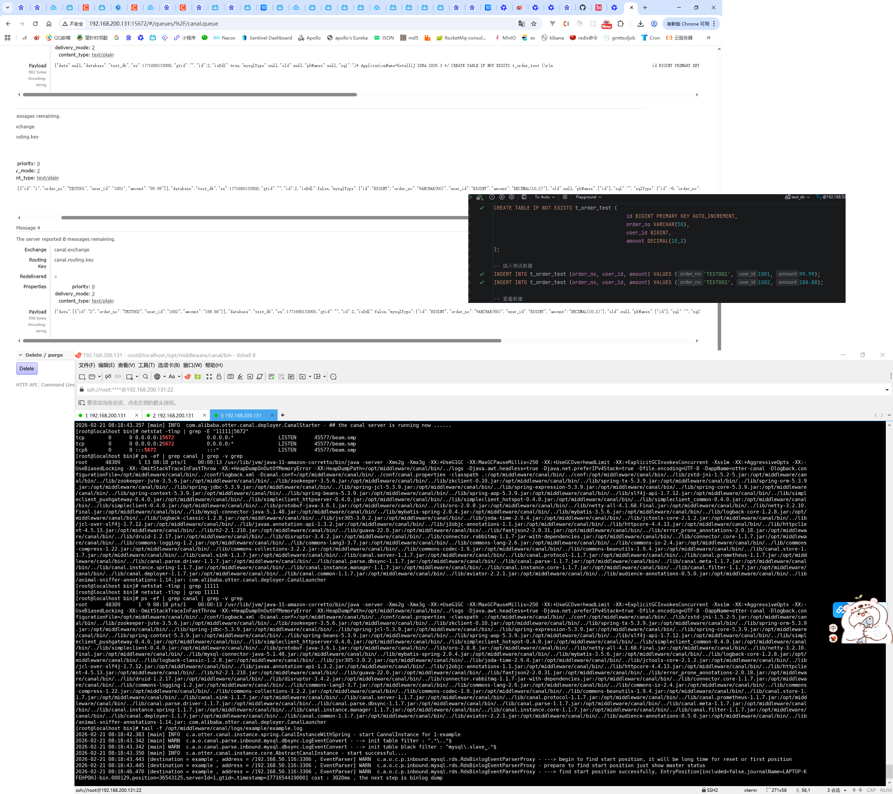

canal的tcp模式

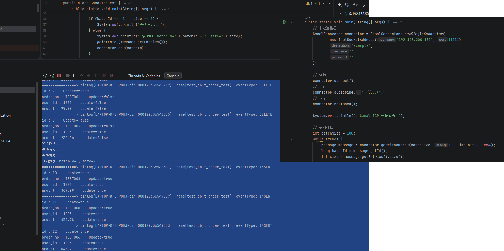

sharding JDBC with snowflake id generator
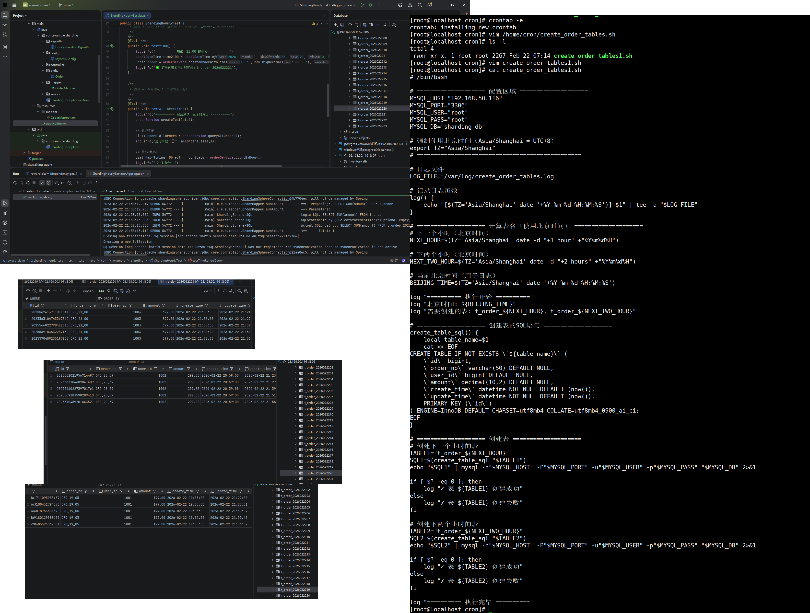

sharding databases instead of sharding tables
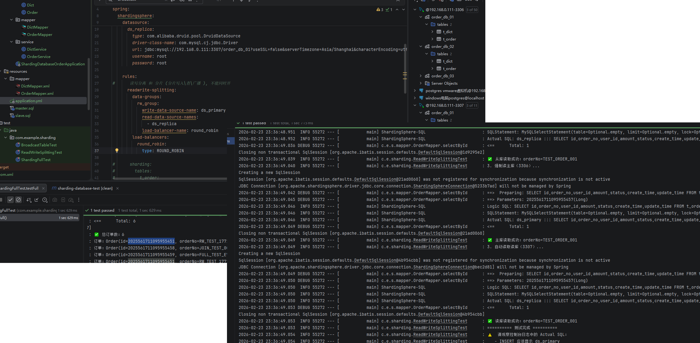

use shardingSphere proxy to do sharding and read-write splitting,伪装成数据库
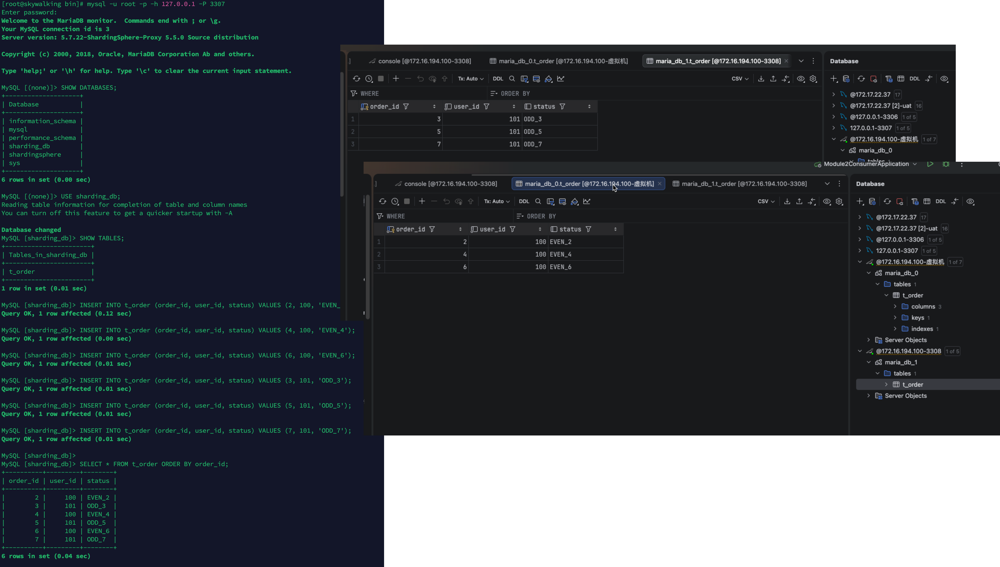
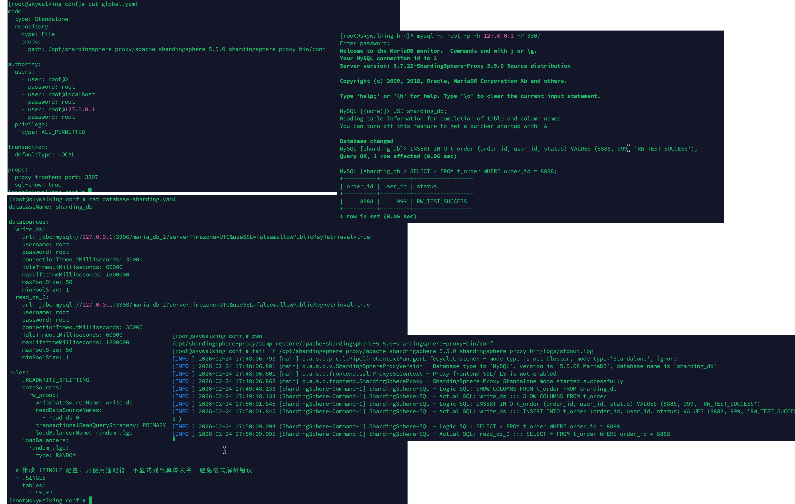